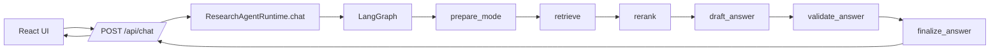

# Research Agent Architecture Walkthrough

This is the practical, engineer-facing walkthrough for the current codebase.
It is written as an onboarding guide: read top to bottom once, then jump to sections when you need implementation detail.

## 1) System At A Glance

Research Agent is a full-stack paper assistant with five modes:

- `Local`: strict paper-grounded answers
- `Global`: open conversational answers with paper context when relevant
- `Writer`: style-aware drafting
- `Reviewer`: adversarial two-reviewer debate flow
- `Comparator`: cross-paper comparison

Core stack:

- Frontend: React (single-file shell `research_agent.jsx`)
- Backend API: FastAPI
- Orchestration: LangGraph state machine
- Retrieval: hybrid dense + sparse + reranking
- Dense store: Pinecone
- Embeddings: local hash (default) or Gemini
- Generation: provider router (`Groq` then `Gemini` in `auto`)

## 2) Request Lifecycle (End To End)

Execution order is fixed and compiled in `build_graph()`.

## 3) Frontend Architecture

Main file:

- `research_agent.jsx`

Frontend responsibilities:

- Mode selection and mode-specific controls
- Upload/delete/re-ingest interactions
- Session-local chat history rendering
- Reviewer panel controls and runway display
- Citation rendering and clipping
- Error surfacing and normalized user-facing failures

Important behavior:

- On initial load, UI can clear backend paper state (configured behavior in this repo revision)
- Reviewer prompt builder supports start messages and free intervention text
- API calls are centralized in `api()` with error simplification

## 4) Backend Entry Points

Primary files:

- `backend/src/research_agent/api.py`
- `backend/src/research_agent/runtime.py`
- `backend/src/research_agent/schemas.py`

Key endpoints:

- `GET /health`
- `GET /api/papers`
- `POST /api/papers/upload`
- `DELETE /api/papers`
- `DELETE /api/papers/{paper_id}`
- `POST /api/papers/{paper_id}/re-ingest`
- `GET /api/style-profile`
- `POST /api/chat`
- `POST /api/retrieval/preview`

Runtime responsibilities:

- Owns ingestion/retrieval/style services
- Invokes LangGraph for chat
- Persists per-session reviewer state (`_reviewer_sessions`)
- Returns final answer + citations + debug payload

## 5) LangGraph Nodes (What Each One Does)

Node flow:

1. `prepare_mode`
2. `retrieve`
3. `rerank`
4. `draft_answer`
5. `validate_answer`
6. `finalize_answer`

### 5.1 `prepare_mode`

Sets strict mode instructions and initializes debug fields.

### 5.2 `retrieve`

Mode-aware retrieval strategy:

- Reviewer: multi-subquery retrieval constrained to selected paper
- Comparator: per-paper retrieval + merge
- Local/Global/Writer: generalized multi-subquery retrieval path

Recent improvement:

- General retrieval now expands subqueries for intent-heavy queries (`mixture of experts`, `MoE`, `proposed model`, etc.) to reduce lexical collision across unrelated papers.

### 5.3 `rerank`

Scores retrieved documents using:

- rank prior
- token overlap with query
- phrase overlap with extracted query n-grams
- mode focus-term overlap
- section quality boosts
- low-signal penalties

For local mode, selection includes lightweight cross-paper coverage balancing to avoid one-paper domination when multiple papers are active.

### 5.4 `draft_answer`

Generates first draft via text provider router.

Special branches:

- Reviewer mode enters reviewer debate engine
- Mode-constraint fast exits (missing paper/missing context)
- Generation failure path goes to structured fallback

### 5.5 `validate_answer`

Second-pass factual validator:

- revises unsupported claims
- enforces mode-specific strictness
- bypasses for certain paths (writer, reviewer debate output, low-context global)

### 5.6 `finalize_answer`

Chooses final text and attaches citations via inline-reference-aware selection.

## 6) Ingestion And Chunking Pipeline

Files:

- `retrieval/ingestion.py`
- `retrieval/chunking.py`
- `retrieval/catalog.py`

Chunking strategy is semantic, not fixed naive windows:

- sanitize page text and drop noise lines
- split into semantic units (sentence-aware)
- embed units
- detect semantic breakpoints using cosine similarity drops
- build chunks with overlap tail carryover
- emit `Document` objects with rich metadata (`paper_id`, `filename`, `chunk_id`, `page`, etc.)

This design is tuned for research PDFs where headings, section transitions, and mixed formatting are common.

## 7) Hybrid Retrieval Design

Files:

- `retrieval/dense.py`
- `retrieval/sparse.py`
- `retrieval/embeddings.py`

### Dense path

- Pinecone cosine retrieval over chunk embeddings
- Optional filter by `paper_id`

### Sparse path

- BM25-like lexical scoring over chunk manifests
- Query term expansion for common research intents (`precision/recall`, `participants`, `OCR`, etc.)

### Fusion

- Reciprocal Rank Fusion (RRF)
- configurable dense/sparse weights
- auto-adjusted toward sparse when local-hash embeddings are active

## 8) Generation Provider Routing

Files:

- `services/text_generation.py`
- `services/groq_text.py`
- `services/gemini_text.py`

Provider policy:

- `GENERATION_PROVIDER=auto`: try Groq, then Gemini
- `groq` or `gemini`: force provider

Failure behavior:

- if all providers fail, graph uses mode-specific fallback
- debug stores fallback stage and model error hints

## 9) Reviewer Arena (Debate Engine)

Reviewer state is persisted per `(session_id, paper_id)` and includes:

- attack vectors
- active vector
- debate history and compressed summary
- turn count, resolution, next speaker
- per-vector verdicts and synthesis cards

Debate mechanics:

- Skeptic and Advocate have opposing instructions
- Router decides next speaker using metadata + hard limits
- hard turn cap prevents infinite loops
- synthesis emits concrete rewrite instruction
- score requests trigger scorecard output path

## 10) Local Mode Failure-Resilience

When generation is unavailable, local mode now uses extractive fallback:

- attempts direct evidence sentence extraction from retrieved context
- supports quantity-intent handling and confidence thresholds
- if evidence is weak/non-specific, returns strict “not in uploaded papers”

This prevents raw chunk dumps and keeps local mode useful under rate-limit pressure.

## 11) Storage Model

Persistent artifacts:

- uploaded PDFs (`backend/storage/uploads`)
- extracted paper text (`backend/storage/papers`)
- chunk manifests (`backend/storage/chunks`)
- paper catalog JSON
- style profile JSON

Vector state:

- Pinecone index + namespace for dense retrieval

Reviewer in-memory session state:

- held in runtime process memory (`_reviewer_sessions`)
- reset when paper is removed or clear endpoint is called

## 12) Config Surface (Most Important Knobs)

Located in `config.py`:

- Retrieval:
  - `retrieval_top_k`
  - `hybrid_dense_top_k`
  - `hybrid_sparse_top_k`
  - `hybrid_rrf_k`
  - `hybrid_dense_weight`
  - `hybrid_sparse_weight`
  - `rerank_top_n`
- Chunking:
  - `chunk_size`
  - `chunk_overlap`
  - `semantic_unit_max_chars`
  - `semantic_similarity_floor`
- Reviewer:
  - `reviewer_max_turns`
  - `reviewer_warning_turn`
  - `reviewer_turns_per_response`
  - `reviewer_attack_vector_count`
- Generation:
  - `generation_provider`
  - `generation_model`
  - `gemini_generation_model`

## 13) Debugging Playbook

Use `debug` payload from `/api/chat`:

- `retrieval_preview` and `retrieval_scores`
- `rerank_preview`
- `response_stage`
- `model_fallback`, `model_error`, `retry_hint`
- reviewer-specific fields: `active_vector_id`, `turn_count`, `next_speaker`, `vector_verdicts`

If quality drops:

1. Check whether retrieval is wrong (`retrieval_preview`)
2. Check whether rerank is wrong (`rerank_preview`)
3. Check whether generation fell back (`model_fallback`)
4. Check citation selection path (`citation_count`)

## 14) Extension Guide

Common safe extensions:

- Add new mode:
  - extend `Mode` enum + frontend mode card
  - add mode instruction in `prepare_mode`
  - add retrieval/query shaping branch
- Improve local factual QA:
  - extend extractive fallback patterns
  - add structured answer templates by intent
- Add provider:
  - implement service adapter
  - register in `TextGenerationService`
- Improve reviewer:
  - stronger vector generation schema checks
  - richer verdict calibration
  - action card templates by category

## 15) Current Tradeoffs

- Reviewer state is in-memory, not externalized; restart clears it.
- Local fallback quality is bounded by extractive heuristics when generation providers are down.
- Multi-paper lexical collisions still exist in edge prompts, but query expansion + phrase rerank significantly reduces them.

---

If you want this walkthrough exported as a polished PDF onboarding handout, convert this markdown plus `docs/graph_state.png` into a one-pager deck or handbook chapter.
